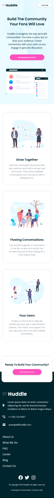
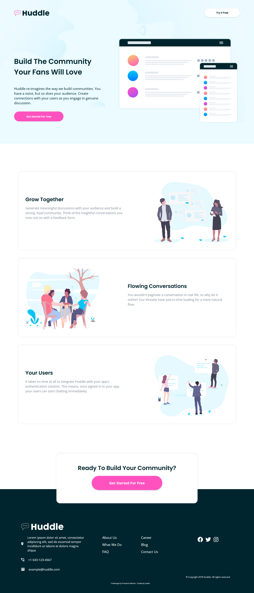

# Frontend Mentor - Huddle landing page with alternating feature blocks solution

This is a solution to the [Huddle landing page with alternating feature blocks challenge on Frontend Mentor](https://www.frontendmentor.io/challenges/huddle-landing-page-with-alternating-feature-blocks-5ca5f5981e82137ec91a5100). Frontend Mentor challenges help you improve your coding skills by building realistic projects. 

## Table of contents

- [Overview](#overview)
  - [The challenge](#the-challenge)
  - [Screenshot](#screenshot)
  - [Links](#links)
- [My process](#my-process)
  - [Built with](#built-with)
  - [What I learned](#what-i-learned)
  - [Continued development](#continued-development)
  - [Useful resources](#useful-resources)
- [Author](#author)

## Overview

### The challenge

Users should be able to:

- View the optimal layout for the site depending on their device's screen size
- See hover states for all interactive elements on the page

### Screenshot

### Links

- Live Site URL: [Huddle landing page with alternating feature blocks](https://leslief10.github.io/huddle-landing-page-alternative-blocks/)

## My process

### Built with

- Semantic HTML5 markup
- CSS custom properties
- Flexbox
- CSS Grid
- Mobile-first workflow

### What I learned

It can be really difficult to use the same image for the header and the main section. 

### Continued development

I'm still working on learning how to properly use Sass, hopefully that will make the css sheets a biit shorter.

### Useful resources

- [Media Queries for Standard Devices ](https://css-tricks.com/snippets/css/media-queries-for-standard-devices/) - This helped me with setting the media queries sizes.

## Author

- Website - [Leslie Fernandez](https://github.com/leslief10)